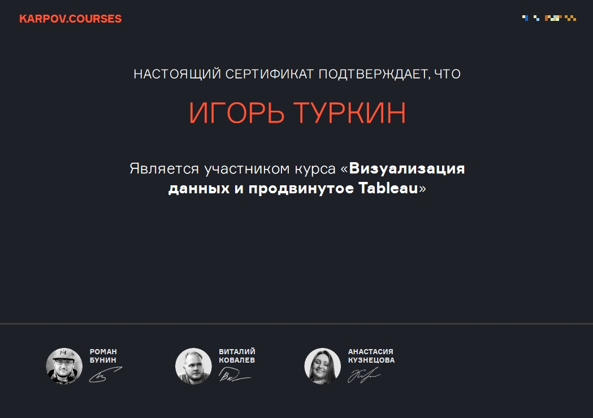
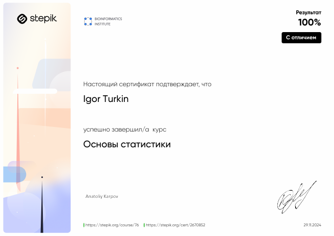
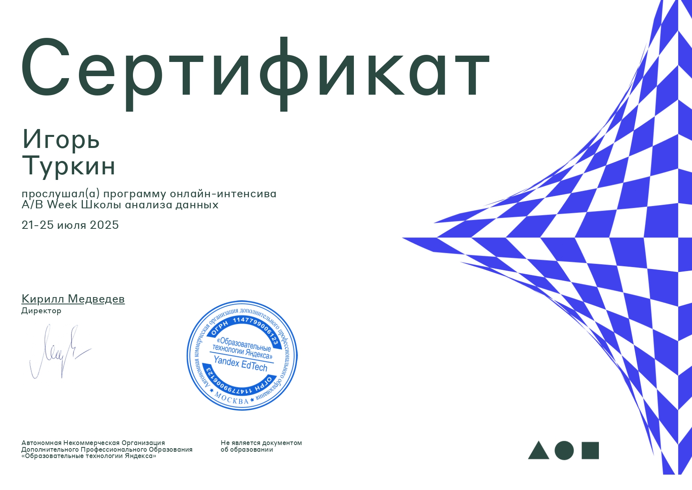

## Обо мне 

<i>Привет, меня зовут Игорь. Я учился в МИСИС на Инженера автоматизированных систем управления, а теперь пришел в Аналитику данных. Коллекционирую кружки у монитора и играю в шахматы.</i>

### Контакты:
*   https://t.me/igor_pvalue
*   igor.pvalue@gmail.com

## Навыки

*  `Python`  
Jupyter Notebook, Google Colab, PyCharm.  
Библиотеки: pandas, numpy, statsmodels, scipy, pingouin, prophet, seaborn, matplotlib  
*  `SQL`  
PostgreSQL, Redash, ClickHouse. Написание сложных запросов, Оконные функции  
*  `BI-системы`  
DataLens, Tableau, Power BI  
*  `Статистические методы`  
t, z, F, U, Хи2 тесты; бутстреп; A/A-сплитование, A/B-тесты; Дисперсионный, многофакторный, корреляционный, регрессионный, когортный, кластерный анализы; RFM-сегментация; Прогнозирование временных рядов; Продуктовые метрики  
*  `Прочие`  
MS Office, GPower, Git, Airflow, AutoHotkey, HTML, Unit-economic  
*  `Другие области`  
Мультимедиа редакторы: Photoshop, Vegas Pro, Reaper, Cubase    

## Курсы 

	
 
<b> Сертификаты </b>

  
  

	

## Проекты

| Проект | Описание | Стек |
|----------------|-----------------|-----------------|
|[A/B тест в таксопарке](https://github.com/igor-turkin/taxi_park)|Анализ результатов A/B теста новой механики мобильного приложения. Расчет продуктовых метрик (CR и пр). Расчет статистической значимости (t-test, Хи-квадрат, Манна-Уитни, Power). Анализ системы сплитования A/A. Визуализация чартов (Power BI)|Python, Стат. методы, A/B-тест, Продуктовые метрики, Power BI| 
|[Статистика Rep Chess](https://github.com/igor-turkin/repchess-project)|Разработка системы сбора и обработки данных для шахматного клуба. Интеграция со сторонними сервисами. Ведение статистики турниров и игроков. Создание чартов и дашбордов|Python, Google Colab, Datalens|
|[Выпускной проект Karpov.Courses](https://github.com/igor-turkin/karpov_exam)|Анализ данных мобильной игры. Проведение когортного анализа. Расчет продуктовых метрик (CR, ARPU, ARPPU и пр). Проверка на статистическую значимость (t-тест, p-value). Проверка гипотез (Bootstrap). Визуализация тестов|Python, Стат. методы, A/B-тест, Продуктовые метрики|
|[SQL для e-commerce](https://github.com/igor-turkin/prod-tasks_1)|Написание сложного запроса для базы данных e-commerce. Расчет финансовых показателей и продуктовых метрик (AOV, ARPU и пр). Использование оконных функций, представлений, подзапросов и джойнов.|SQL, Продуктовые метрики|
|[Промежуточный проект Karpov.Courses](https://github.com/igor-turkin/first_project)|Анализ данных интернет-магазина. Обработка грязных данных. Финансовых показателей. Проведение когортного анализа. Построение RFM-сегментации.|Python, Стат. методы, Продуктовые метрики|

