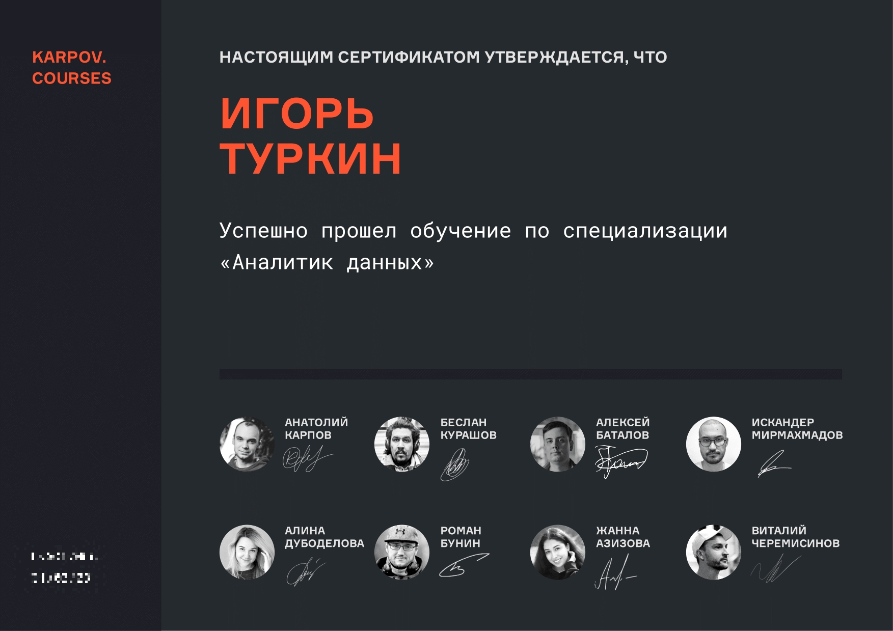
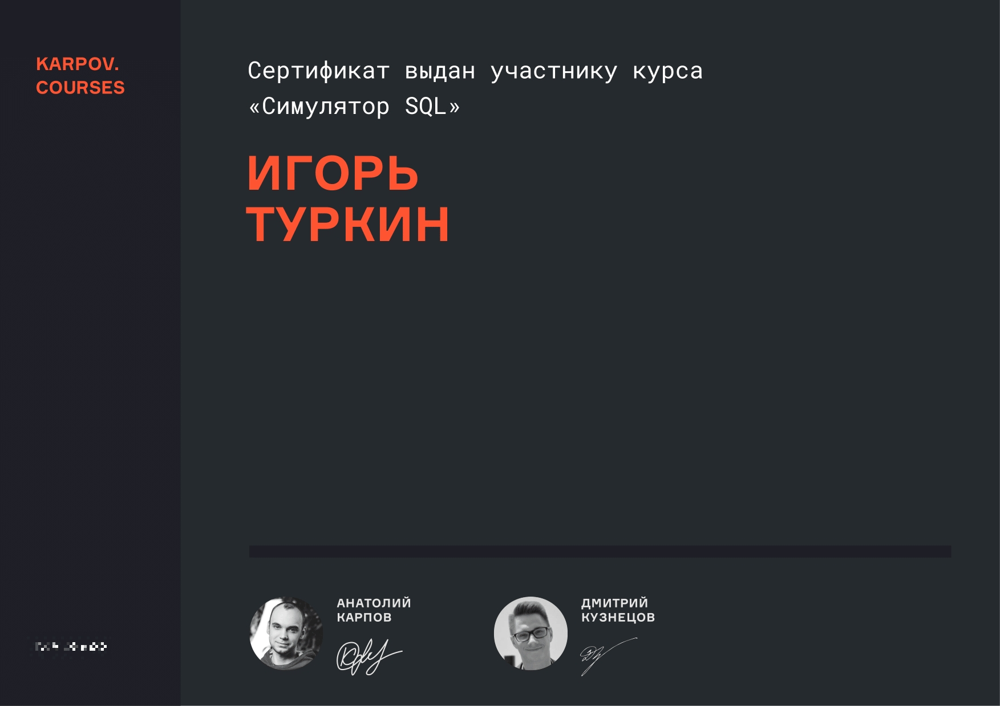

*Обо мне*

Привет, меня зовут Игорь. Я учился на Инженера АСУ, а теперь пришел в аналитику данных. А еще занимаюсь шахматами. Коллекционирую чашки у монитора

  

*Навыки*

`Python`
Jupyter Notebook, Google Colab, PyCharm. Библиотеки: pandas, numpy, statsmodels, scipy, pingouin, prophet, seaborn, matplotlib

`SQL`
PostgreSQL, Redash, ClickHouse. Написание сложных запросов, использование оконных функций

`BI-системы`
Tableau, DataLens, Looker

`Статистические методы`
дисперсионный, факторный, корреляционный, регрессионный, когортный, кластерный анализы; T, Z, F, U, Хи тесты; бутстреп; A/A-сплитование, A/B-тесты; прогнозирование временных рядов

`Прочее`
MS Office, GPower, Git, Airflow, AutoHotkey, Unit-economic, продуктовые метрики. 

`Другие области`
Аудио-,видео-,фото-редакторы

`Иностранный язык`
Английский – B1 – Средний
